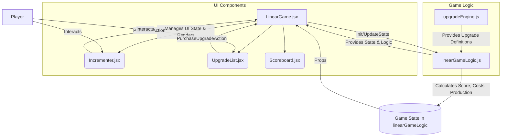

# Architectural Plan: Linear Ticker Game Fixes and Enhancements

## 1. Overview

This document outlines the architectural plan for implementing bug fixes, display adjustments, and re-balancing for the linear ticker game. The plan is based on the requirements specified in [`specs/linear_game_fixes_requirements.md`](specs/linear_game_fixes_requirements.md:1) and the logic detailed in the pseudocode documents for [`linearGameLogic.js`](specs/linearGameLogic_pseudocode.md:1), [`upgradeEngine.js`](specs/upgradeEngine_pseudocode.md:1), and [`Incrementer.jsx`](specs/Incrementer_jsx_pseudocode.md:1).

The core goals are to:
- Ensure incrementer purchase logic is additive (REQ-001).
- Clarify display values for individual incrementer production vs. total score (REQ-002).
- Set "Show Purchased" to `false` by default (REQ-003).
- Enforce whole numbers for all game calculations and displays (REQ-004).
- Re-balance the first incrementer (REQ-005).
- Slow down overall game scaling and reduce upgrade impact (REQ-006).

The proposed architecture emphasizes modularity, testability, and maintainability.

## 2. Affected Components and Modifications

The primary components involved are:

-   **`src/components/linear/linearGameLogic.js`**:
    -   Will manage the core game state (`score`, `totalPerSecond`, `incrementers`, `upgrades`, `settings`).
    -   **New Data Points**: Each object in the `incrementers` array will now include:
        -   `individualProductionValue`: The production rate of a single unit of that incrementer type (floored).
        -   `totalProductionFromType`: The total production from all owned units of that incrementer type (calculated as `count * individualProductionValue`, then floored).
    -   **Logic Changes**:
        -   `calculateIncrementerProduction()`: Will compute `individualProductionValue` (applying base value, flat bonuses, and multipliers, then flooring) and `totalProductionFromType`. This directly addresses REQ-001 and REQ-002.
        -   All functions modifying score, costs, or production values (`purchaseIncrementer`, `calculateIncrementerCost`, `applyUpgrade`, `updateGameTick`, `calculateTotalPerSecond`) will use `Math.floor()` to ensure whole numbers (REQ-004).
        -   `initializeGame()`: Will set `gameState.settings.showPurchased` to `false` (REQ-003) and initialize the `baseValue` of the first incrementer ('thingamabob') to 1 (REQ-005).
        -   Cost calculation formulas and upgrade effect applications will be adjusted to allow for re-balancing as per REQ-006, driven by values from `upgradeEngine.js`.

-   **`src/components/linear/upgradeEngine.js`**:
    -   Will continue to define the properties of available upgrades (ID, name, description, cost, effects).
    -   **Balancing Adjustments (REQ-005, REQ-006)**:
        -   The `cost` of upgrades will be reviewed and likely increased. All costs will be whole numbers.
        -   The `value` of upgrade `effects` will be adjusted:
            -   For the first incrementer ('thingamabob'), initial `FLAT_BONUS` upgrades will have small decimal values (e.g., 0.1, 0.2) so multiple are needed to increase its floored `individualProductionValue`.
            -   `MULTIPLIER` and `GLOBAL_MULTIPLIER` effect values will be reduced (e.g., from 1.2 to 1.05) to slow progression.
    -   This module will primarily be a data source; the application of these effects and ensuring whole numbers in game state remains the responsibility of `linearGameLogic.js`.

-   **`src/components/linear/Incrementer.jsx`** (and potentially `src/components/shared/Incrementer.jsx` if it's the one being used or needs similar changes):
    -   **Props**: Will receive `individualProductionValue` and `totalProductionFromType` as props from its parent component (likely `LinearGame.jsx`).
    -   **Display Changes (REQ-002)**:
        -   Clearly display the `individualProductionValue` (e.g., "Value: X per sec").
        -   Optionally display `totalProductionFromType` (e.g., "Total from Type: Y per sec").
        -   Continue to display `count` and `currentCost`. All displayed numerical values will be whole numbers, as the props received will already be floored by `linearGameLogic.js`.

-   **`src/components/linear/LinearGame.jsx`**:
    -   Manages the overall UI structure for the linear game.
    -   Will fetch initial game state from `linearGameLogic.initializeGame()`, which includes `settings.showPurchased = false`.
    -   Will pass the updated incrementer data (including `individualProductionValue` and `totalProductionFromType`) from the `gameState.incrementers` array as props to each rendered `Incrementer.jsx` component.
    -   Will manage the state of the "Show Purchased" toggle and filter displayed upgrades accordingly.
    -   The main scoreboard will display `gameState.score` and `gameState.totalPerSecond`, which will be distinct from individual incrementer values.

## 3. Data Flow and Component Interactions

**Flow Description:**

1.  **Initialization**: `LinearGame.jsx` initializes, calling `linearGameLogic.initializeGame()`. This sets up the initial `gameState`, including default `showPurchased = false` and balanced incrementer/upgrade values based on definitions from `upgradeEngine.js`.
2.  **Display**: `LinearGame.jsx` uses `gameState` to render `Scoreboard.jsx`, `Incrementer.jsx` instances, and `UpgradeList.jsx`. `Incrementer.jsx` receives `individualProductionValue` and `totalProductionFromType`.
3.  **User Actions**:
    -   Purchasing an incrementer in `Incrementer.jsx` calls a handler in `LinearGame.jsx`, which invokes `linearGameLogic.purchaseIncrementer()`.
    -   Buying an upgrade in `UpgradeList.jsx` calls a handler in `LinearGame.jsx`, which invokes `linearGameLogic.applyUpgrade()`.
4.  **State Updates**: `linearGameLogic.js` functions update the `gameState` (e.g., `score`, `incrementer.count`, `incrementer.individualProductionValue`, `incrementer.totalProductionFromType`, `totalPerSecond`). All numerical updates are floored.
5.  **Re-render**: Changes in `gameState` trigger re-renders in `LinearGame.jsx` and its children, displaying the updated information.

## 4. Modularity

-   **Separation of Concerns**:
    -   Game mechanics and state management are encapsulated within `linearGameLogic.js`.
    -   Upgrade data and balancing parameters are defined in `upgradeEngine.js`, acting as a configuration module.
    -   UI rendering and user interaction are handled by React components (`.jsx` files).
-   **Component Reusability**: `Incrementer.jsx` (especially if a shared version) remains a presentational component driven by props.
-   **Focused Changes**: Balancing (REQ-005, REQ-006) will primarily involve data changes in `upgradeEngine.js` and potentially constants in `linearGameLogic.js`, minimizing impact on UI code. Logic fixes (REQ-001, REQ-004) are contained within `linearGameLogic.js`. Display fixes (REQ-002) are in `Incrementer.jsx`.

## 5. Testability

-   **Unit Testing**:
    -   Functions within `linearGameLogic.js` (e.g., `calculateIncrementerProduction`, `purchaseIncrementer`, `applyUpgrade`, `calculateIncrementerCost`) can be unit-tested extensively by mocking `gameState` and `upgradeEngine.js` definitions. The TDD anchors in the pseudocode provide a strong basis for these tests.
    -   `upgradeEngine.js` can be validated to ensure upgrade definitions meet schema requirements (e.g., costs are whole numbers).
-   **Component Testing**:
    -   `Incrementer.jsx` and other UI components can be tested by providing various sets of props and verifying the rendered output.
-   **Integration Testing**: The interaction between `linearGameLogic.js` and `upgradeEngine.js` can be tested to ensure upgrades apply effects correctly and game progression matches expectations after balancing.

## 6. Maintainability

-   **Clear Boundaries**: The separation between logic, data, and presentation makes the codebase easier to understand and modify.
-   **Localized Impact**:
    -   Changes to game balance are largely confined to `upgradeEngine.js`.
    -   UI text or layout changes are confined to specific `.jsx` components.
    -   Core game rule changes are confined to `linearGameLogic.js`.
-   **Readability**: Using descriptive names for new data fields (`individualProductionValue`, `totalProductionFromType`) improves code clarity.

## 7. Conclusion

This architectural plan addresses all specified requirements by modifying existing components in a structured way. The introduction of new data points for incrementer production and the consistent application of whole number logic are key changes. The separation of concerns will facilitate easier development, testing, and future maintenance, particularly for game balancing.